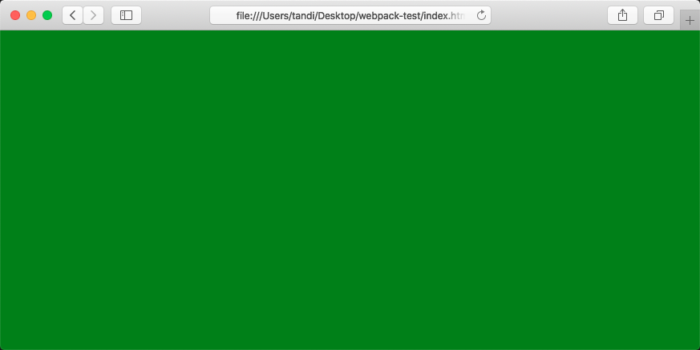
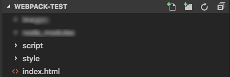
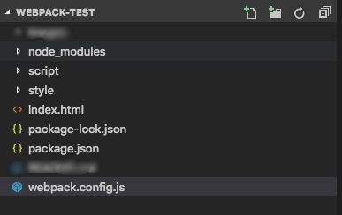

## 建议
阅读下文之前建议简单看一下上一篇文件：[webpack+vue介绍](http://www.tandi.wiki/webpack_vue%E4%BB%8B%E7%BB%8D/)

webpack文档：https://www.webpackjs.com/concepts/

## webpack安装和入门

> 例子中使用的webpack版本为4.32.2

1）初始化项目和安装webpack
```
mkdir webpakc-test
cd webpack-test
npm init
npm install webpack webpack-cli --save-dev 
```

2）使用webpack打包
```
echo 'function hello () {}' > hello.js
webpack hello.js
```
打包完成后，会在更目录生成一个dist文件夹，其中里面的main.js就是webpack的结果

3）接下来测试以下将非js文件打包生成main.js

> 那css文件做例子，创建css文件
```
echo 'body{ background: green; }' > style.css
```

> 修改原来的hello.js来引入该css文件，如下
``` javascript
require('./style.css')
function hello () {
}
```
4）再一次进行打包

```
webpack hello.js 
```
> 如无意外的话，会出现以下错误，提示如果想要打包该类型的文件则需要特性的loader来行
```
ERROR in ./style.css 1:4
Module parse failed: Unexpected token (1:4)
You may need an appropriate loader to handle this file type.
```
原因：webpack本身只能打包js文件，如果需要打包其他类型的话，则需要对应类型文件的load的辅助才能进行打包

5）安装css-loader和style-loader

> 参考官方文档：https://webpack.js.org/concepts/loaders
>
> css-loader：加载css文件
>
> style-loader：将style嵌入到html
```
npm install --save-dev css-loader style-loader
```

6）安装完loader后，修改hello.js，引入style-loader和css-loader来示意webpack使用loader来加载css文件，并将其转为可嵌入html的内容

``` javascript
/**
 * 除了下面这种指定loader的方式外，还可以在命令行中指定，如下
 * webpack hello.js --module-bind 'css=style-loader!css-loader'
 * 其中loader顺序是从右边到左边，从下面到上面（下面再说）
 */
require('style-loader!css-loader!./style.css')
function hello () {
}
```

7）再一次进行打包
```
webpack hello.js
```

8）新建一个html引入main.js来看看效果

```
echo 'script type="text/javascript" src="dist/main.js"></script>' > index.html
```




## 常用的webpack命令行参数

> 可以通过webpack --help查看参数使用

1）watch

每次修改文件都要重新执行一次webpack进行打包，这样显然有繁琐，这是可以使用webpack的watch参数来监察着hello.js的变化，如下

```
webpack hello.js --watch
```

2）progress

打包时，在终端打印进度

3）config

指定webpack配置文件

4）output-path

指定打包输出文件的输出路径

5）output-filename

指定打包输出文件的名称

6）mode

指定当前开发环境，如 `--mode production` 或者` --mode developement`


## 使用配置文件来配置webpack(推荐)

### 入门示例

> 一般在项目中，都会使用配置文件来去配置webpack，而不是直接使用命令行；
>
> 原因很简单，更加方便和容易管理；

1）初始化项目



2）初始化项目和安装webpack、基本的loader

```
npm init
npm i webpack webpack webpack-cli css-loader style-loader --save-dev
```

3）创建webpack配置文件webpack.config.js，如下

> 官网文档：https://www.webpackjs.com/concepts/configuration/



4）新建入口文件

> 入口文件实质就是上个例子的hello.js，即需要被打包的对象

```
echo 'function main() { alert("mian.js!!!") }' > main.js
```

5）配置webpack.config.js

> 以下为一个简单的webpack配置示例

```javascript
// 导出模块
module.exports = {
  // 入口文件，入口文件实质就是上个例子的hello.js，即需要打包的js
  entry: './main.js', 
  // 输出配置
  output: {
    filename: 'main.bundle.js' // 输出文件名称，默认情况输出路径在更目录dist（会自动生成该文件夹）
  }
};
```

6）打包-方法1(直接使用webpack命令)

```
webpack
```

可以看到执行在终端使用webpack就可以根据配置文件进行打包，即webpack默认情况下，会在项目的根路径查找一个叫webpack.config.js的文件文件来读取配置，如果存在的话；

如果配置文件不在根路径，则可以使用config参数指定即可；

7）打包-方法2(使用npm脚本-推荐)

> 一般项目中会用这种

1. 在package.json中配置script参数

   ``` javascript
     "scripts": {
       "test": "echo \"Error: no test specified\" && exit 1",
       // webpack配置如下
       "build": "webpack --colors --progress"
     },
   ```

2. 使用npm命令执行打包操作

   ```
   npm run build
   ```


### 配置说明

> 建议参考官网：https://www.webpackjs.com/configuration/

``` javascript
// 加入路径模块
const path = require('path');

module.exports = {
  mode: "production", // "production" | "development" | "none"  // Chosen mode tells webpack to use its built-in optimizations accordingly.

  entry: "./app/entry", // string | object | array  // 这里应用程序开始执行
  // webpack 开始打包

  output: {
    // webpack 如何输出结果的相关选项

    path: path.resolve(__dirname, "dist"), // string
    // 所有输出文件的目标路径
    // 必须是绝对路径（使用 Node.js 的 path 模块）

    filename: "bundle.js", // string    // 「入口分块(entry chunk)」的文件名模板（出口分块？）

    publicPath: "/assets/", // string    // 输出解析文件的目录，url 相对于 HTML 页面

    library: "MyLibrary", // string,
    // 导出库(exported library)的名称

    libraryTarget: "umd", // 通用模块定义    // 导出库(exported library)的类型

    /* 高级输出配置（点击显示） */  },

  module: {
    // 关于模块配置

    rules: [{ // 模块规则（配置 loader、解析器等选项）
        test: /\.jsx?$/,
        include: [
          path.resolve(__dirname, "app")
        ],
        exclude: [
          path.resolve(__dirname, "app/demo-files")
        ],
        // 这里是匹配条件，每个选项都接收一个正则表达式或字符串
        // test 和 include 具有相同的作用，都是必须匹配选项
        // exclude 是必不匹配选项（优先于 test 和 include）
        // 最佳实践：
        // - 只在 test 和 文件名匹配 中使用正则表达式
        // - 在 include 和 exclude 中使用绝对路径数组
        // - 尽量避免 exclude，更倾向于使用 include

        issuer: { test, include, exclude },
        // issuer 条件（导入源）

        enforce: "pre",
        enforce: "post",
        // 标识应用这些规则，即使规则覆盖（高级选项）

        loader: "babel-loader",
        // 应该应用的 loader，它相对上下文解析
        // 为了更清晰，`-loader` 后缀在 webpack 2 中不再是可选的
        // 查看 webpack 1 升级指南。

        options: {
          presets: ["es2015"]
        },
        // loader 的可选项
      },

      {
        test: /\.html$/,
        test: "\.html$"

        use: [
          // 应用多个 loader 和选项
          "htmllint-loader",
          {
            loader: "html-loader",
            options: {
              /* ... */
            }
          }
        ]
      },

      { oneOf: [ /* rules */ ] },
      // 只使用这些嵌套规则之一

      { rules: [ /* rules */ ] },
      // 使用所有这些嵌套规则（合并可用条件）

      { resource: { and: [ /* 条件 */ ] } },
      // 仅当所有条件都匹配时才匹配

      { resource: { or: [ /* 条件 */ ] } },
      { resource: [ /* 条件 */ ] },
      // 任意条件匹配时匹配（默认为数组）

      { resource: { not: /* 条件 */ } }
      // 条件不匹配时匹配
    ],

    /* 高级模块配置（点击展示） */  },

  resolve: {
    // 解析模块请求的选项
    // （不适用于对 loader 解析）

    modules: [
      "node_modules",
      path.resolve(__dirname, "app")
    ],
    // 用于查找模块的目录

    extensions: [".js", ".json", ".jsx", ".css"],
    // 使用的扩展名

    alias: {
      // 模块别名列表

      "module": "new-module",
      // 起别名："module" -> "new-module" 和 "module/path/file" -> "new-module/path/file"

      "only-module$": "new-module",
      // 起别名 "only-module" -> "new-module"，但不匹配 "only-module/path/file" -> "new-module/path/file"

      "module": path.resolve(__dirname, "app/third/module.js"),
      // 起别名 "module" -> "./app/third/module.js" 和 "module/file" 会导致错误
      // 模块别名相对于当前上下文导入
    },
    /* 可供选择的别名语法（点击展示） */
    /* 高级解析选项（点击展示） */  },

  performance: {
    hints: "warning", // 枚举    maxAssetSize: 200000, // 整数类型（以字节为单位）
    maxEntrypointSize: 400000, // 整数类型（以字节为单位）
    assetFilter: function(assetFilename) {
      // 提供资源文件名的断言函数
      return assetFilename.endsWith('.css') || assetFilename.endsWith('.js');
    }
  },

  devtool: "source-map", // enum  // 通过在浏览器调试工具(browser devtools)中添加元信息(meta info)增强调试
  // 牺牲了构建速度的 `source-map' 是最详细的。

  context: __dirname, // string（绝对路径！）
  // webpack 的主目录
  // entry 和 module.rules.loader 选项
  // 相对于此目录解析

  target: "web", // 枚举  // 包(bundle)应该运行的环境
  // 更改 块加载行为(chunk loading behavior) 和 可用模块(available module)

  externals: ["react", /^@angular\//],  // 不要遵循/打包这些模块，而是在运行时从环境中请求他们

  stats: "errors-only",  // 精确控制要显示的 bundle 信息

  devServer: {
    proxy: { // proxy URLs to backend development server
      '/api': 'http://localhost:3000'
    },
    contentBase: path.join(__dirname, 'public'), // boolean | string | array, static file location
    compress: true, // enable gzip compression
    historyApiFallback: true, // true for index.html upon 404, object for multiple paths
    hot: true, // hot module replacement. Depends on HotModuleReplacementPlugin
    https: false, // true for self-signed, object for cert authority
    noInfo: true, // only errors & warns on hot reload
    // ...
  },

  plugins: [
    // ...
  ],
  // 附加插件列表


  /* 高级配置（点击展示） */}
```

